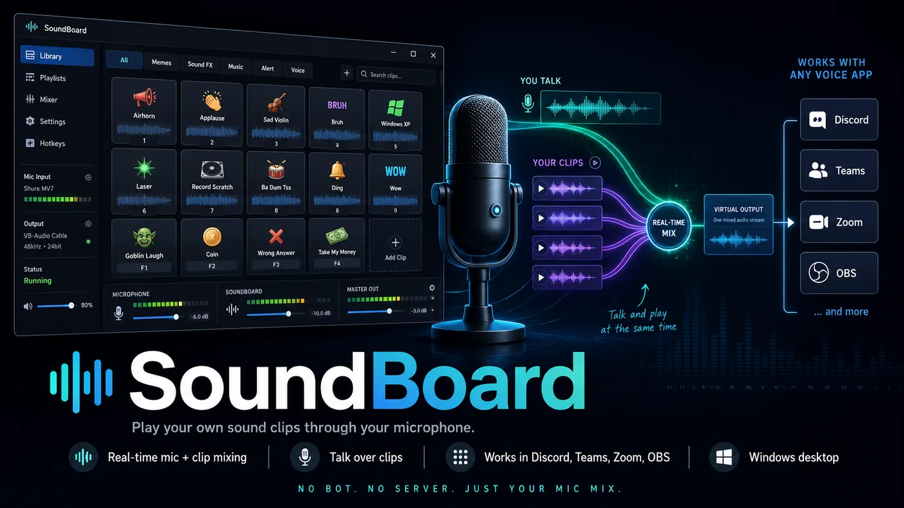

# SoundBoard

<p align="center">
  
</p>

**Play your own sound clips through your microphone, so everyone in the call hears them.**

SoundBoard is a Windows desktop soundboard that mixes clips into your live microphone signal.
Not a Discord bot — no token, no server, nothing to invite. It works in Discord, and equally in
Teams, Zoom, OBS, or anything else that takes a microphone.

Because it is a real-time *mixer* rather than a device switcher, **you can talk and fire clips at
the same time**. Your voice is not muted or replaced while a clip plays.

---

## Highlights

- **Works with any voice app.** Nothing is Discord-specific in the audio path — SoundBoard
  presents itself as a microphone, so any application that accepts mic input just works.
- **Talk over your clips.** Your voice and the clips are summed sample-by-sample in one duplex
  audio device, not crossfaded or switched.
- **A serious mic chain, not a toy.** The same **WebRTC Audio Processing Module** that Discord
  itself uses — high-pass filter, noise suppression, automatic gain control — plus **RNNoise**
  for a stronger suppression tier and speech-probability voice detection.
- **Hear what others hear.** A confidence monitor plays back the exact signal being sent down the
  cable, so you can check your own noise suppression and gate before anyone else has to.
- **Bring your own clips.** No audio ships with SoundBoard. Drop files into a folder, relaunch,
  done — no rebuild, no import step, no library format.
- **Global hotkeys and a tray icon.** Push-to-talk, fire clips without focusing the window, keep
  it running in the background.
- **One self-contained executable.** ~16 MB. No loose DLLs, no runtime to install.

---

## At a glance

| | |
|---|---|
| **Platform** | Windows 10/11 (x64). Windows-only by construction — see [Why Windows only](#why-windows-only) |
| **Language** | Go 1.25+, cgo required |
| **UI** | [Wails v2](https://wails.io) + WebView2, vanilla JS frontend (no framework, no build step) |
| **Audio** | `malgo`/miniaudio → WASAPI, duplex, 48 kHz stereo float32 |
| **DSP** | WebRTC APM (BSD-3-Clause, embedded DLL) + RNNoise (BSD-3-Clause, vendored, cgo) |
| **Hard dependency** | [VB-CABLE](https://vb-audio.com/Cable/) by VB-Audio — third-party, donationware, **not bundled** |
| **Licence** | MIT — see [LICENSE](LICENSE) and [THIRD_PARTY_NOTICES.md](THIRD_PARTY_NOTICES.md) |
| **Build output** | `build/bin/soundboard.exe` — the only artefact this project produces |
| **Bundled audio** | **None.** The clip library is entirely user-supplied |

---

## Quick start

### 1. Get a build

Download a release, or [build from source](#build-from-source) (one command if you have Go and
a C toolchain).

### 2. Run it

On first launch, if VB-CABLE is not installed, SoundBoard explains what it is, where it comes
from, and asks whether to install it. **Nothing is downloaded or installed without you agreeing
first**, and declining closes the app rather than leaving it half-working.

VB-CABLE is a virtual audio device — it is what lets SoundBoard hand audio to other applications
as if it were a microphone. Installing an audio driver needs administrator approval, and usually
a Windows restart before the new device appears.

### 3. Add clips

```
Documents\SoundBoard\<category>\<clip>.wav
```

SoundBoard creates that folder on first run and tells you where it is; **Open folder** takes you
straight there. Each subfolder becomes a category in the grid. Drop in `.wav`, `.mp3`, `.flac` or
`.ogg` and press **Reload** — no relaunch needed. Two optional helpers are included — see
[Bring your own clips](#bring-your-own-clips).

Want them somewhere else? **Change…** points SoundBoard at any folder you like and remembers it.

### 4. Point your voice app at the cable

In Discord: **Settings → Voice & Video → Input Device → `CABLE Output (VB-Audio Virtual Cable)`**.

Then turn Discord's own audio processing **off** — this is the single most important setting, and
the most common reason a soundboard "doesn't work". See [Discord settings](#discord-settings).

---

## Requirements

- **Windows 10 or 11**, x64.
- **VB-CABLE** — installed on first run with your consent, or manually from
  [vb-audio.com/Cable](https://vb-audio.com/Cable/). It is donationware; if you find it useful,
  VB-Audio asks for a donation. SoundBoard does not bundle or redistribute it.
- **Microsoft Edge WebView2 runtime** — preinstalled on Windows 11 and current Windows 10.
- A microphone. (Obviously, but the whole design assumes one exists and stays the default.)

---

## How it works

There is no bot and no network protocol. The trick is a **virtual audio cable**.

VB-CABLE creates a loopback pair: anything written to **CABLE Input** comes out of **CABLE
Output**, which Windows presents as a recording device. SoundBoard opens **one duplex WASAPI
device** — capturing your real microphone and playing into CABLE Input — and mixes the two
signals in the real-time callback:

```
out[i] = clamp(mic[i] * micGain + Σ (clip[i] * clipGain * masterGain), -1, +1)
```

Your voice app is then pointed at CABLE Output, so it receives the mix.

```
  mic  ─┐
        ├─►  duplex device  ──►  CABLE Input ──(virtual cable)──► CABLE Output ──► your voice app
 clips ─┘    (mix + clamp)
                  ▲
            SoundBoard writes here
```

Because the mix happens *inside* SoundBoard rather than by switching devices, both sources are
live simultaneously — hence talking over clips. Clips are decoded and resampled to
48 kHz / 2ch / float32 **lazily on first play**, never inside the audio callback, so startup is
instant and the real-time path stays allocation-free.

On launch SoundBoard can also point the **Windows default recording device** at CABLE Output, and
restores your previous default when you quit. That is a convenience for apps that follow the
system default; apps configured with an explicit input device are unaffected either way.

> **What SoundBoard can and cannot know.** It can see which device Windows has as the default
> recording device. It **cannot** see which input device Discord (or any other app) has selected,
> or what their noise-suppression settings are — those are internal to those applications. The UI
> therefore reports only local facts and never claims your voice app is receiving anything.

---

## The audio chain

The **Mic & Audio** view applies a voice-processing chain to your **live microphone only**.
Soundboard clips are summed in **after** the chain and are never denoised, gated or levelled —
you want your voice cleaned up, not your sound effects mangled.

```
mic → gain → downmix to mono → WebRTC APM (HPF + noise suppression + AGC)
    → RNNoise (Strong tier and/or speech-probability VAD) → hard gate
    → back to stereo → mix with clips → cable
```

**WebRTC APM.** The real `AudioProcessingModule` — the same library Discord uses — at Discord's
capture configuration: high-pass filter on, noise suppression on, AGC on (GainController1
adaptive-digital + limiter), echo cancellation off, mono. One `ProcessCapture` call per 10 ms
(480-sample) frame.

**RNNoise** ([Xiph](https://gitlab.xiph.org/xiph/rnnoise), vendored and cgo-compiled) does two
jobs: it provides the **Strong** noise-suppression tier (a Krisp analogue, with the APM's own
suppressor switched off), and it supplies the **speech probability** used by the advanced voice
gate — so breathing, which has energy but is not speech, stops opening your mic.

**A hard gate sits after the APM**, because the APM has no hard mute. Mute and push-to-talk-up are
enforced on the **real-time thread**, so the mic is authoritatively silent even if the DSP worker
falls behind.

**Real-time safety.** The heavy DSP runs on a worker goroutine fed by lock-free SPSC ring buffers,
never inside the audio callback. The mic path adds roughly one period plus one frame of latency.
If the worker underruns, the callback emits mic passthrough for that span rather than stalling.

The APM ships as a self-contained WebRTC DLL that is **embedded in the binary and loaded at
runtime** via `LoadLibrary` — so the C++ APM is never linked at cgo compile time, the module still
builds with plain MinGW gcc, and the produced `.exe` needs no loose DLL beside it.

### Confidence monitor

The local monitor ("You hear") has two sources:

- **Clips** *(default)* — your headset plays clips only. Your own voice is not monitored, so
  there is no echo of yourself.
- **Transmitted** — the monitor plays the **exact signal sent to the cable**: your processed voice
  plus the clips. This is what the far end receives, so you can hear your own noise suppression,
  gain control and gate before anyone else has to.

It is implemented without compromising real-time safety: the duplex callback taps a copy of its
final mix into a lock-free SPSC ring (only while transmitted mode is active), and the monitor
callback drains it. The ring is primed one period at start so the two independent device clocks
don't race, and holds-last-then-ramps-to-silence on underrun rather than splicing stale audio.

### Controls

| Control | What it does |
|---|---|
| **Input mode** | **Voice-activated** (default), **Push-to-talk**, **Always-on**, **Mute**. Mute and PTT-up are enforced on the real-time thread. |
| **Input sensitivity** | Gate open threshold, 0–100%. The live ring meter beside it shows the current gate level so you can tune against your actual speaking voice. |
| **Automatically determine input sensitivity** | Threshold tracks a slow noise-floor follower instead of the manual slider. |
| **Advanced voice activity** | Gate opens on RNNoise's trained speech probability rather than raw energy, so breathing no longer trips it. Falls back to an energy latch if RNNoise is unavailable. |
| **Noise suppression** | **None**, **Standard** (APM *Moderate*), **High** (APM *High*, the default), **Strong** (RNNoise — the Krisp analogue). |
| **Echo cancellation** | Toggles the APM echo canceller. Off by default. |
| **Automatic gain control** | APM GainController1, adaptive-digital + limiter. Brings a quiet talker up, tames a loud one. |
| **Attenuation** | Ducks clips under an open mic gate via an envelope follower, 0–100% (default ≈ −9 dB). |
| **Push-to-talk hotkey** | Re-bound live from the UI and persisted. A combo another application already owns is rejected and logged, leaving the previous binding intact. |
| **Audio subsystem** | Cosmetic selector kept for Discord parity. Persisted, but has **no engine effect** — there is one WASAPI backend. |

---

## Discord settings

SoundBoard cleans, gates and levels your microphone *before* the cable, then mixes unprocessed
clips on top. If Discord also runs its own processing over that mix, it will fight yours — and
**Krisp is the specific problem**: it is trained to keep human voice and discard everything else,
which is exactly what your sound effects are.

In **Discord → Settings → Voice & Video**:

| Setting | Set to |
|---|---|
| Input Device | `CABLE Output (VB-Audio Virtual Cable)` |
| Noise Suppression | **None** |
| Echo Cancellation | Off |
| Automatic Gain Control | Off |
| Automatically Adjust Input Sensitivity | Off |
| Advanced Voice Activity | Off |
| Bypass System Audio Input Processing | Off |

> If clips sound choppy, lose their first syllable, or vanish entirely, check Noise Suppression
> first. It is the cause the overwhelming majority of the time.

SoundBoard **cannot read or change these** — they live inside Discord and there is no API for
them. The same checklist appears in the Mic & Audio view, marked *not checked*, because the app
has no way to verify it.

---

## Bring your own clips

**No audio ships with this project.** The library is yours, and you are responsible for the
licensing of whatever you put in it.

```
Documents\SoundBoard\
├── memes\
│   ├── air_horn.wav
│   └── sad_trombone.wav
└── reactions\
    └── applause.wav
```

- Each top-level folder becomes a **category**; each file becomes a **clip**.
- Display name = filename with `_`/`-` turned into spaces, extension stripped.
- Supported: **`.wav`, `.mp3`, `.flac`, `.ogg`**.
- Drop files in and press **Reload** — no relaunch, no rebuild.
- Files sitting loose in the clip folder are **not** loaded; they must be inside a category folder.
- The folder lives in your **Documents**, not beside the executable, so moving or reinstalling the
  app never orphans your library. It is created on first run, and **Change…** repoints it anywhere.

### Optional helpers

Both require `ffmpeg` on `PATH` and normalise to **−16 LUFS, 48 kHz stereo** — the format the
engine mixes at, so no resampling happens on first play.

**`scripts/import_sounds.sh`** — normalise audio you already have. Downloads nothing, contacts no
website.

```bash
scripts/import_sounds.sh memes ~/clips/airhorn.mp3
scripts/import_sounds.sh games ~/clips/game-sfx/      # a whole folder
scripts/import_sounds.sh --dry-run memes ~/clips/     # show, write nothing
```

**`scripts/fetch_freesound.sh`** — fetch Creative-Commons audio from
[Freesound](https://freesound.org) via its documented public API, using your own key.

```bash
export FREESOUND_API_KEY=...        # free: https://freesound.org/apiv2/apply/
scripts/fetch_freesound.sh reactions "applause"
scripts/fetch_freesound.sh games "8-bit coin" -n 5 --license cc0
```

Every fetched clip is recorded in `sounds/<category>/ATTRIBUTION.md` with its ID, author, licence
and source URL. **CC-BY audio requires crediting the author if you redistribute it** — keep that
file with the audio. `--license cc0` restricts results to public-domain clips.

> **No scrapers ship with this project.** Bulk-downloading from meme-sound sites generally
> breaches their terms of service, and the audio is usually someone else's copyrighted work.

---

## Build from source

### Prerequisites

- **Go 1.25+**
- **cgo enabled with MinGW-w64 gcc on `PATH`** (`CC=gcc`, no clang/MSVC override). Required by
  `malgo` (miniaudio) and the vendored RNNoise C sources.
- **[Wails v2 CLI](https://wails.io)** — optional; a plain `go build` works too.

### Build

```bash
CGO_ENABLED=1 wails build -trimpath
#   -> build/bin/soundboard.exe
```

Or without the Wails CLI:

```bash
CGO_ENABLED=1 go build -trimpath -tags desktop,production \
  -ldflags "-H=windowsgui -s -w" -o build/bin/soundboard.exe .
```

> **`-tags desktop,production` is mandatory, not an optimisation.** Wails guards its real
> `CreateApp` behind `//go:build !dev && !production && !bindings`. Build without one of those
> tags and you still get a working-looking executable that compiles, links and exits 0 — but at
> launch it shows only a message box reading *"Wails applications will not build without the
> correct build tags"*. There is no compile error and no warning; the failure appears only when a
> user runs it. Check any binary with:
>
> ```bash
> strings -a build/bin/soundboard.exe | grep -c "will not build without the correct build tags"
> ```
>
> `0` is a real build. `1` means you shipped the stub.

> **Use `-trimpath` for anything you distribute.** Go compiles absolute source paths into the
> binary for panic traces, so without it your `GOPATH`, home directory and checkout path ship to
> whoever you hand it to.

**`build/bin/soundboard.exe` is the only build output this project produces.** Two binaries in a
tree is how you end up debugging a stale one.

### Test

```bash
go vet ./...
CGO_ENABLED=1 go test -count=1 ./...
CGO_ENABLED=1 go test -race ./internal/audio/...   # the real-time path
```

---

## Project layout

```
soundboard/
├── main.go                  # Wails entrypoint: frameless window, tray, lifecycle
├── app.go                   # methods bound into the webview + live events
├── backend.go               # wires engine/catalog/setup/config/hotkeys to the bound App
├── systray.go               # companion tray icon on its own goroutine
├── frontend/dist/           # the UI: index.html + styles.css + app.js (vanilla, no build step)
├── internal/
│   ├── audio/               # real-time duplex mixer, DSP worker, SPSC rings, gate, ducking
│   ├── apm/                 # WebRTC AudioProcessingModule (embedded DLL, runtime-loaded)
│   ├── denoise/             # RNNoise (vendored Xiph C sources, cgo)
│   ├── catalog/             # walks sounds/, lazy decode + resample to 48k/2ch/f32
│   ├── config/              # JSON settings + log path
│   ├── devices/             # WASAPI enumeration, VB-CABLE detection
│   ├── hotkeys/             # global hotkeys + push-to-talk
│   ├── setup/               # VB-CABLE detect, consented install, routing engage/restore
│   ├── winaudio/            # COM MMDevice + IPolicyConfig (default-device switching)
│   └── wizard/              # setup checklist text
├── scripts/                 # import_sounds.sh, fetch_freesound.sh
└── docs/                    # GUI design spec
```

**Runtime files** live in `%AppData%\soundboard\` — `config.json` (volumes, favourites, hotkeys,
processing settings) and `soundboard.log` (device resolution, routing, install, shutdown trail).

---

## Status and limitations

**Verified by tests and by running it.** The DSP maths, ring buffers, gate hysteresis, config
round-trips, device name matching and hotkey parsing are unit-tested; the real-time mixer, worker
and ring handoff are race-clean under `-race`.

**Judged by ear, by you.** Whether the noise suppression *sounds* good on your microphone and in
your room, whether the gate opens reliably on your voice, whether the ducking depth feels right —
none of that can be settled by a test suite. Defaults are chosen sensibly; your ears decide.

### Known limitations

- **Windows only.** See below.
- **Latency.** Routing your microphone through an in-app mixer adds a small amount, tuned low but
  not zero. Inherent to the design.
- **VB-CABLE is required** and is third-party. SoundBoard cannot function without it.
- **Audio-subsystem selector is cosmetic** — persisted for Discord parity, no engine effect.
- **Voice-app settings are invisible to SoundBoard.** It cannot verify that Discord is actually
  using the cable, and does not pretend to.

### Why Windows only

The routing depends on WASAPI, VB-CABLE, and the undocumented `IPolicyConfig` COM interface for
switching the default recording device. None of that has a portable equivalent — a macOS or Linux
port would be a different implementation sharing only the mixing logic, not a build tag.

### Etiquette

Soundboards that inject audio into voice channels can be disruptive, and many servers have rules
about them. Use it where it's welcome.

---

## Contributing

Contributions are welcome — see [CONTRIBUTING.md](CONTRIBUTING.md) for setup, the toolchain
requirements, and what to check before opening a PR.

One rule worth stating up front: **please do not submit audio files.** The clip library is
user-supplied by design, and third-party audio cannot be licence-verified.

Security issues: see [SECURITY.md](SECURITY.md). Please use GitHub's private vulnerability
reporting rather than a public issue.

---

## Licence

MIT — see [LICENSE](LICENSE).

SoundBoard bundles third-party code, and the notices travel with the binary as well as the source.
See **[THIRD_PARTY_NOTICES.md](THIRD_PARTY_NOTICES.md)** for full texts and provenance:

- **WebRTC AudioProcessingModule** — BSD-3-Clause, plus a separate patent grant. Embedded as a
  DLL, and statically links Abseil (Apache-2.0), libgcc/libstdc++ (GPL-3.0 with the GCC Runtime
  Library Exception) and mingw-w64 winpthreads.
- **RNNoise / KISS FFT / CELT LPC** — BSD-3-Clause, cgo-compiled into the binary.
- **Wails**, **malgo**, and the other Go dependencies — MIT / Apache-2.0 / BSD-3-Clause / Unlicense.

**VB-CABLE is not bundled or redistributed.** It is donationware by
[VB-Audio Software](https://vb-audio.com/Cable/), downloaded from VB-Audio's own servers with your
consent. If you find it useful, please support them.

SoundBoard is an independent project. It is not affiliated with, endorsed by, or sponsored by
Discord Inc. or VB-Audio Software. "Discord" is a trademark of Discord Inc.
